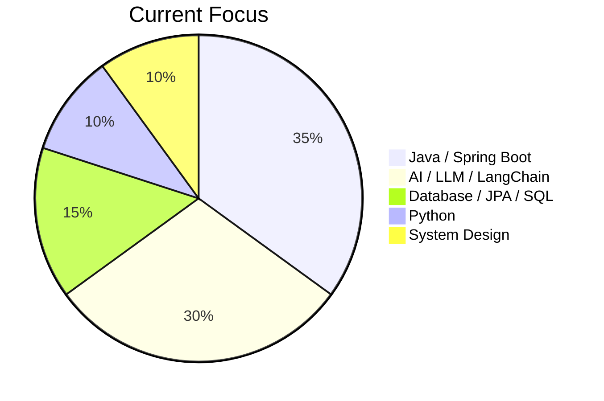
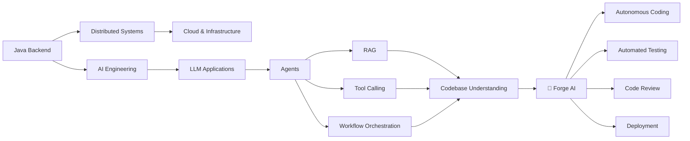

<div align="center">


<br/>


[](https://github.com/rahull005)

</div>

---

### 🧭 Java Backend Engineer → 🤖 AI/LLM Engineer → 🏗️ Autonomous Software Engineering

I build **production-oriented backend systems** and **AI-powered developer tools**. My current focus is combining **Java / Spring Boot** engineering with **Python, LLMs, LangChain, agentic workflows**, and autonomous software engineering.

```text
Backend Engineering (Java, Spring Boot, SQL)
        │
        ▼
Distributed Systems (Async, Microservices, Redis, Kafka)
        │
        ▼
AI Engineering (Python, LLMs, LangChain, RAG, Agents)
        │
        ▼
🚀 Forge AI — Autonomous Software Engineering
```

---

## 🚀 What I'm Building

<table>
<tr>
<td width="50%" valign="top">

### 🔥 Forge AI
**Autonomous Software Engineering Platform**

Turns natural-language requirements into working, tested software.

```
Requirement → Plan → Analyze Codebase
    → Generate/Modify Code → Run Tests
    → Fix Failures → Review → Deploy → Monitor → Improve
```

`Python` `LangChain` `LLMs` `Agents` `RAG` `FastAPI` `Vector DB`

</td>
<td width="50%" valign="top">

### 🏦 Pay Order Processing Platform
**Enterprise financial workflow backend**

Case-based lifecycle integrating Approval, Financial, Rules engines and external channels (Flex, Printing, Delivery).

```
PENDING → IN_PROGRESS → RUNNING → SUCCESS / FAILED
```

`Java 21` `Spring Boot` `Spring Data JPA` `PostgreSQL`

</td>
</tr>
</table>

---

## 🧠 Tech Stack

<div align="center">

**Backend**


**AI / LLM**


**Data & Databases**


**Tools**


</div>

---

## 📊 GitHub Analytics

<div align="center">


</div>

---

## 🎯 Engineering Focus



---

## 🏗️ Roadmap Toward Forge AI



---

## 🧩 Technology Map

| Area | Technologies |
|---|---|
| **Languages** | Java, Python, C, JavaScript |
| **Backend** | Spring Boot, Spring Web, FastAPI |
| **Security** | Spring Security, JWT, RBAC, BCrypt |
| **Persistence** | JPA, Hibernate, PostgreSQL, Oracle, MySQL |
| **Caching / Messaging** | Redis, Kafka |
| **AI / LLM** | LangChain, Prompt Engineering, Agents, RAG, Tool Calling |
| **ML / Data** | NumPy, Pandas, Matplotlib, TensorFlow/Keras |
| **Architecture** | REST, Microservices, Async Processing, Case-based Workflows |
| **Testing** | JUnit, Mockito |

---

## 🎯 Engineering Philosophy

> **Don't just write code. Understand the system.**

```text
Requirements → Domain Model → API Design → Business Logic
   → Persistence → Integrations → Testing → Deployment → Observability
```

---

## 🤝 Let's Connect

<div align="center">

[](https://linkedin.com/in/rahul-suryasen-90b57732a)
[](mailto:rahulsuryasen2002@gmail.com)

</div>

<div align="center">

☕ Code → 🧠 Learn → 🔧 Build → 🧪 Test → 🚀 Ship → 🔁 Improve

⭐ **If something here interests you, feel free to explore, star, or connect.**

</div>
